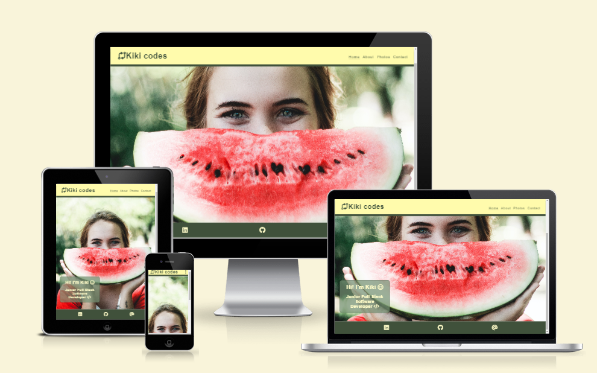
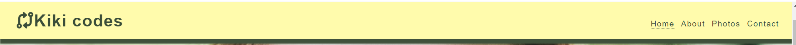
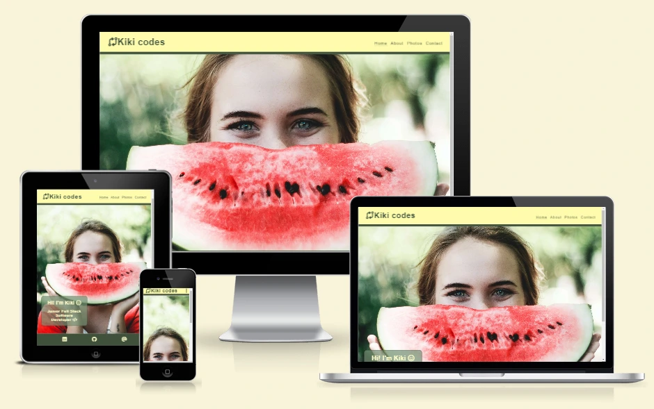
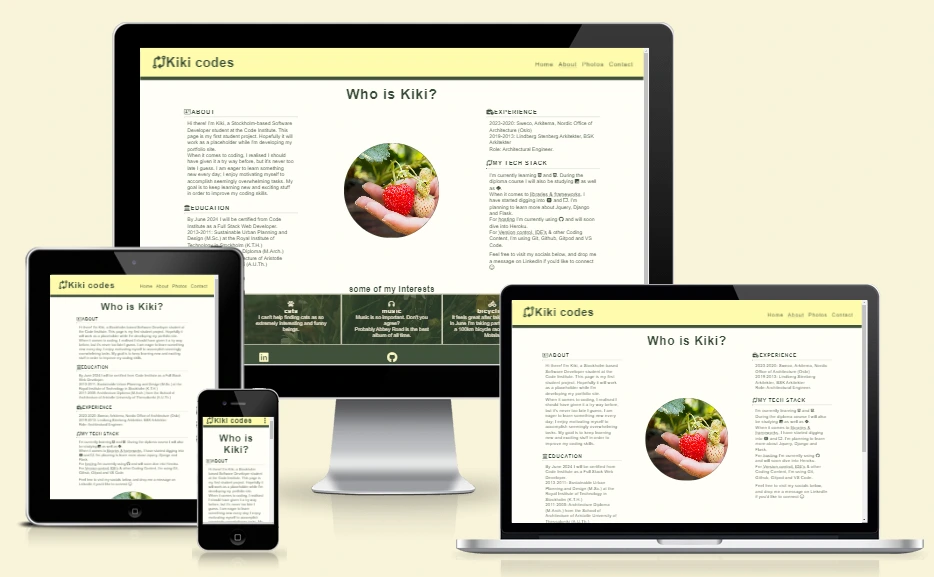
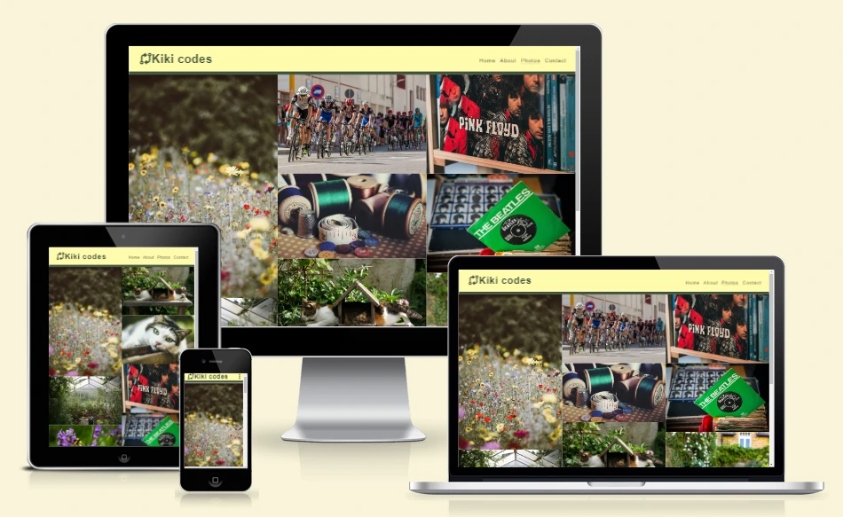
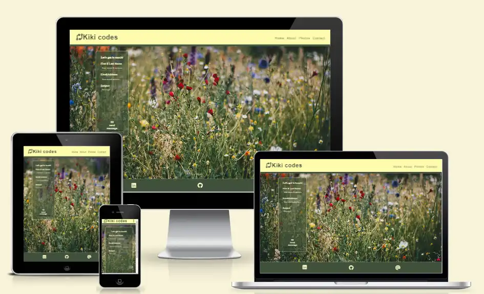

# Kiki codes

Visit the deployed site: [Kiki codes](https://kikiberg.github.io/Kikicodes/)

This page is my first student project. 
Hopefully it will work as a placeholder while I'm developing my portfolio site.

## CONTENTS

* [User Experience](#user-experience-ux)
  * [User Stories](#user-stories)

* [Design](#design)
  * [Colour Scheme](#colour-scheme)
  * [Typography](#typography)
  * [Imagery](#imagery)
  * [Wireframes](#wireframes)
  * [Features](#features)
    * [The Home Page](#the-home-page)
    * [The About Page](#the-about-page)
    * [The Photos Page](#the-photos-page)
    * [The Contact Page](#the-contact-page)
    * [Future Implementations](#future-implementations)
  * [Accessibility](#accessibility)

* [Technologies Used](#technologies-used)
  * [Languages Used](#languages-used)
  * [Frameworks, Libraries & Programs Used](#frameworks-libraries--programs-used)

* [Deployment & Local Development](#deployment--local-development)
  * [Deployment](#deployment)
  * [Local Development](#local-development)
    * [How to Fork](#how-to-fork)
    * [How to Clone](#how-to-clone)

* [Testing](#testing)
  * [Solved Bugs](#solved-bugs)
  * [Known Bugs](#known-bugs)
  
* [Credits](#credits)
  * [Code Used](#code-used)
  * [Content](#content)
  * [Media](#media)
  * [Acknowledgments](#acknowledgments)

- - -

## User Experience (UX)

I wanted to create an online portfolio about myself.

### User Stories

#### First Time Visitor Goals

* I want to make it interesting enough for possible future employers to see.
* I want the site to be responsive for different device sizes.
* I want the site to be easy to navigate.

#### Returning and frequent Visitor Goals

* I want to be able to see updates (news page) about Kiki's fulfillments.

- - -

## Design

### Colour Scheme

As the pages of the site have a background image, I wanted to keep the colour scheme used on the site quite small so as to not overwhelm users. Red and green  are very typical colours in traditional British public houses, with the red & green used for upholstery.

In my css file I have used variables to declare colours, and then used these throughout the css file. I was recently introduced to this method during a hackathon - it is a useful convention to use as it allows you to alter the colour throughout the website if you decide to update a colour, by changing the colour once in the variable.

* I have used `#FFFCC9` & `#40513B` as the primary and secondary colours used for the sites text.
* I have used `#FFFEF7` as the overlay used over the sites background image.
* I have used `#FFFBAC` for the header.
* I have used `#40513B` for the footer.

  

### Typography

Google Fonts was used to import the chosen fonts for use in the site.

* I have used the google font [Open Sans](https://fonts.google.com/specimen/Open+Sans?query=open+sans).
* The reason I chose this one is for its clean and modern sans-serif typeface.
* It’s readable in both small and huge sizes.
* It's simple and makes the content easily readable.

### Imagery

As the website is called Kiki codes, I wanted to make the coding theme stand out by using icons related to coding.

### Wireframes

Wireframes were created for mobile, tablet and desktop using balsamiq.

### Features

The website is comprised of a home page, an about page, a photos page & a contact page.

All Pages on the website are responsive and have:

* A favicon in the browser tab.

* The title of the site at the top of every page. This title also acts as a link back to the home page.

* Every page will display as dotted and underlined when there is a hovering. This feature is available only on larger devices.

#### The Home Page

The home page of Kiki codes displays the site's name as a title, an image in the background and then a container which holds some Hi text.

#### The About Page

The about page displays the sites name as a title. There are two sections ............

#### The Photos Page

The photos page displays the sites name as a title............

#### The Contact Page

The contact page displays the sites name as a title............

#### Future Implementations

In future implementations I would like to:

1. Add one more page that will include any updates and news about Kiki's fulfillments.
2. Look further into the accessibility for people with colour blindness, perhaps by adding symbols such as a tick or cross next to the answer when they are checked.

### Accessibility

I have been mindful during coding to ensure that the website is as accessible friendly as possible. This has been have achieved by:

* Using semantic HTML.
* Using a hover state on all buttons on the site to make it clear to the user if they are hovering over a button.
* Choosing a sans serif font for the site - these fonts are suitable for people with dyslexia.
* Ensuring that there is a sufficient colour contrast throughout the site.

  

As the site relies on colour to display to the user whether an answer is correct or incorrect, I was interested to see what this would look like for someone with red/green colour blindness. I used the chrome extension [Web Disability Simulator](https://chrome.google.com/webstore/detail/web-disability-simulator/olioanlbgbpmdlgjnnampnnlohigkjla) to be able to see what someone with red/green colour blindness would see.

In a future implementation I think it would be a great accessibility feature to also add a symbol such as a tick or cross on the answer button to enable people who are colour blind to also be able to access the quiz easier. Each of the images below have whether they are correct/incorrect in the name. Can you tell which one is which?

- - -

## Technologies Used

### Languages Used

HTML, CSS

### Frameworks, Libraries & Programs Used

* [Pexels](https://www.pexels.com/) and [Unsplash](https://unsplash.com/) - Used for finding images.

* [Font Awesome](https://fontawesome.com/) - Used for the icons.

* [Balsamiq](https://balsamiq.com/) - Used to create wireframes.

* [Git](https://git-scm.com/) - For version control.

* [Github](https://github.com/) - To save and store the files for the website.

* [GitPod](https://gitpod.io/) - IDE used to create the site.

* [Google Fonts](https://fonts.google.com/) - To import the fonts used on the website.

* [Google Developer Tools](https://developers.google.com/web/tools) - To troubleshoot and test features, solve issues with responsiveness and styling.

* [TinyPNG](https://tinypng.com/) To compress images

* [Birme](https://www.birme.net/) To resize images and convert to webp format.

* [Favicon.io](https://favicon.io/) To create favicon.

* [Am I Responsive?](http://ami.responsivedesign.is/) To show the website image on a range of devices.

* [Shields.io](https://shields.io/) To add static badges to the README

* [Web Disability Simulator](https://chrome.google.com/webstore/detail/web-disability-simulator/olioanlbgbpmdlgjnnampnnlohigkjla) - a google chrome extension that allows you to view your site as people with accessibility needs would see it.

* [Webpage Spell-Check](https://chrome.google.com/webstore/detail/webpage-spell-check/mgdhaoimpabdhmacaclbbjddhngchjik/related) - a google chrome extension that allows you to spell check your webpage. Used to check the site and the readme for spelling errors.

- - -

## Deployment & Local Development

### Deployment

The site is deployed using GitHub Pages - [Kiki codes](https://kikiberg.github.io/Kikicodes/).

To Deploy the site using GitHub Pages:

1. Login (or signup) to Github.
2. Go to the repository for this project, [KikiBerg/Kikicodes](https://github.com/KikiBerg/Kikicodes).
3. Click the settings button.
4. Select pages in the left hand navigation menu.
5. From the source dropdown select main branch and press save.
6. The site has now been deployed, please note that this process may take a few minutes before the site goes live.

### Local Development

#### How to Fork

To fork the repository:

1. Log in (or sign up) to Github.
2. Go to the repository for this project, [KikiBerg/Kikicodes](https://github.com/KikiBerg/Kikicodes)
3. Click the Fork button in the top right corner.

#### How to Clone

To clone the repository:

1. Log in (or sign up) to GitHub.
2. Go to the repository for this project, [KikiBerg/Kikicodes](https://github.com/KikiBerg/Kikicodes)
3. Click on the code button, select whether you would like to clone with HTTPS, SSH or GitHub CLI and copy the link shown.
4. Open the terminal in your code editor and change the current working directory to the location you want to use for the cloned directory.
5. Type 'git clone' into the terminal and then paste the link you copied in step 3. Press enter.

- - -

## Testing

Please refer to [TESTING.md](TESTING.md) file for all testing carried out.

- - -

## Credits

### Code Used

* I used [this You Tube tutorial](https://www.youtube.com/watch?v=XH5OW46yO8I) to learn how to create a modal for the how to play section.

* As the API I used for the questions declared the correct answer and then had an array of incorrect answers, I had to find a way to shuffle the answers together so that the correct answer wouldn't always appear on the same button. Research led me to the Fisher-Yates Shuffle. Other methods of shuffling can favour some items in the array more than others, however the Fisher Yates Shuffle allows for a more even spread of probability of the answer being placed on each button. I used the following [YouTube tutorial](https://www.youtube.com/watch?v=eATLMjs7y4s&list=PL5egNEXQTWmFHAoWFVRLNAvD-9zzyWVxA&index=3) to further adapt the shuffle I had researched on W3Schools to work with the data I had.

As the JavaScript modules of the Code Institute Diploma did not cover local storage, I had to do a bit of research into this topic myself in order to set up the high scores section of my site.

* I used this [video tutorial](https://www.youtube.com/watch?v=DFhmNLKwwGw&list=PLDlWc9AfQBfZIkdVaOQXi1tizJeNJipEx&index=9) on YouTube by [James Q Quick](https://www.youtube.com/channel/UC-T8W79DN6PBnzomelvqJYw) which taught me to save the team name and score to an object, that would then be saved into an array in local storage. It also explained how to sort the items in the array into descending score order, and then to splice the array, I have used the MAX_HIGH_SCORES as my point to splice.

* I used this [video tutorial](https://www.youtube.com/watch?v=jfOv18lCMmw&list=PLDlWc9AfQBfZIkdVaOQXi1tizJeNJipEx&index=10) on YouTube by [James Q Quick](https://www.youtube.com/channel/UC-T8W79DN6PBnzomelvqJYw) to learn how to insert the local storage into the high scores page.

### Content

All questions for my site were pulled from [The Open Trivia Database](https://opentdb.com/) using their API.

All other content for the site, such as introduction messages and instructions were written by myself.

### Media

[Page background image of a pub](https://pixabay.com/photos/bar-pub-cafe-establishment-stools-2209813/)

### Acknowledgments

I would like to acknowledge the following people:

* Jubril Akolade - My Code Institute Mentor.

* The Code Institute Slack channel Peer Code Review - Thank you to everyone who took the time to review my project and look over the code.

* The Tutor support from Code Institute for assisting and explaining.