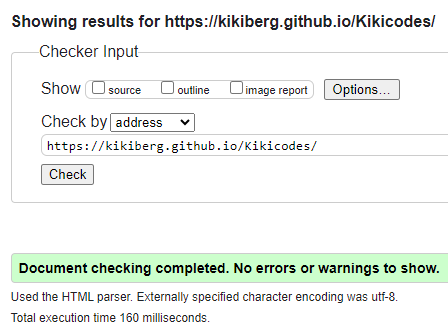
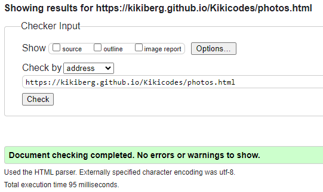
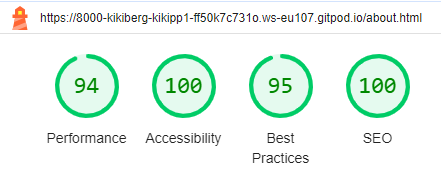
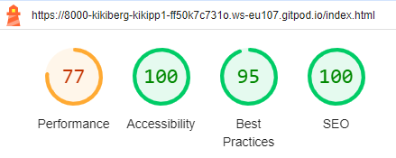
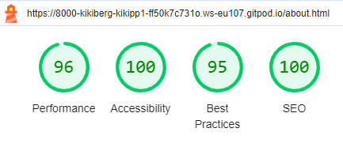
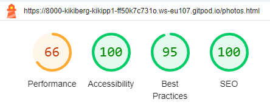
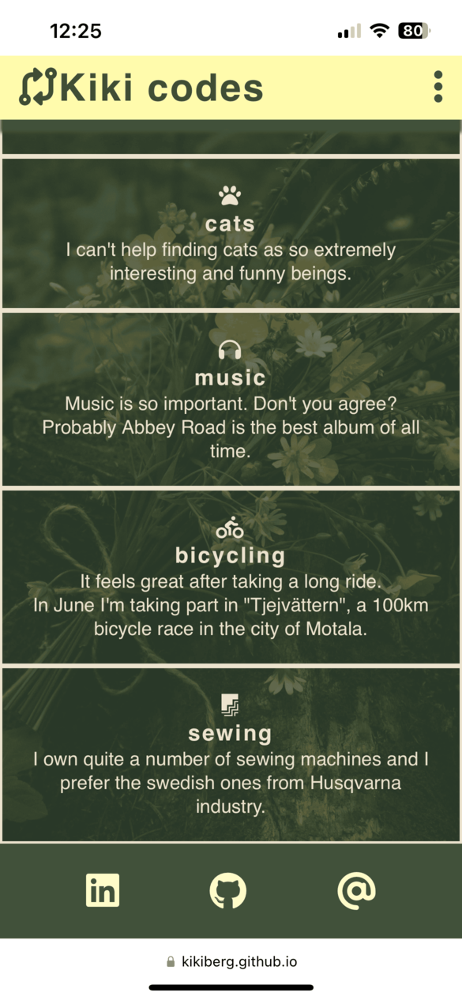
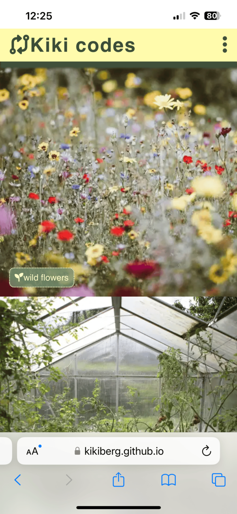
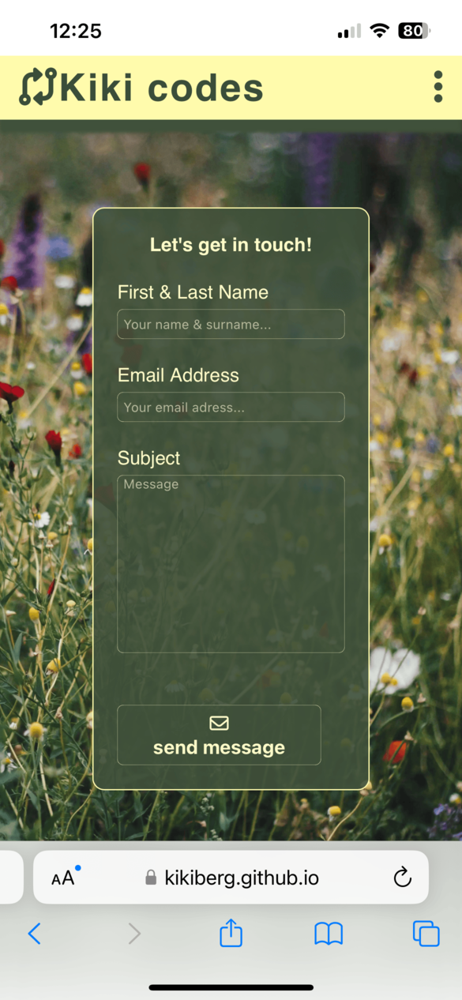

# Kiki codes -  Testing

Visit the deployed site: [Kiki codes](https://kikiberg.github.io/Kikicodes/)

Return back to the [README.md](README.md) file.

- - -

## CONTENTS

* [AUTOMATED TESTING](#automated-testing)
  * [W3C Validator](#w3c-validator)
  * [Lighthouse](#lighthouse)
  * [Responsiveness](#responsiveness)
  * [Browser Compatibility](#browser-compatibility)

* [MANUAL TESTING](#manual-testing)
  * [Testing User Stories](#testing-user-stories)
  * [User Testing](#user-testing)

Testing was ongoing throughout the entire build. I utilised Chrome developer tools whilst building to pinpoint and troubleshoot any issues as I went along.
During development I made use of google developer tools to ensure everything was working correctly and to assist with troubleshooting when things were not working as expected.
I have gone through each page using google chrome developer tools to ensure that each page is responsive on a variety of different screen sizes and devices.

- - -

## AUTOMATED TESTING

### W3C Validator

[W3C](https://validator.w3.org/) was used to validate the HTML and CSS on all pages of the website.

#### W3C HTML Validator

Page | W3C URL | Screenshot | Notes |
| --- | --- | --- | --- |
| Home | [W3C](https://validator.w3.org/nu/?doc=https%3A%2F%2Fkikiberg.github.io%2FKikicodes%2F) |  | Passed. No warnings or errors |
| About | [W3C](https://validator.w3.org/nu/?doc=https%3A%2F%2Fkikiberg.github.io%2FKikicodes%2Fabout.html) |  | Passed. No warnings or errors|
| Photos | [W3C](https://validator.w3.org/nu/?doc=https%3A%2F%2Fkikiberg.github.io%2FKikicodes%2Fphotos.html) |  | Passed. No errors. 1 warning for section lacking heading. I added this in CSS and turned it to hidden. |
| Contact | [W3C](https://validator.w3.org/nu/?doc=https%3A%2F%2Fkikiberg.github.io%2FKikicodes%2Fcontact.html) |  | Passed. No warnings or errors|

#### W3C CSS Validator

File | Screenshot | Notes |
| --- | --- | --- |
| style.css |  | Passed. No errors. 1 warning for google font import style, which I ignored. |

- - -

### Lighthouse

I used Lighthouse within the Chrome Developer Tools to test the performance, accessibility, best practices and SEO of the website.

#### Desktop Results

#### Mobile Results

- - -

### Responsiveness

I have tested my deployed project on multiple devices to check for responsiveness issues.
Apart from the Chrome Devtools, I've used [this site](http://www.responsinator.com/) to quickly check responsiveness on different devices.

| Device | Home | About | Photos | Contact | 
| --- | --- | --- | --- | --- |
| Mobile |  |  |  | |  |  | Works as expected |
| Tablet |  |  |  |  |  |  | Works as expected |
| Desktop |  |  |  |  |  |  | Works as expected |

- - -

### Browser Compatibility

I have tested my deployed project on multiple browsers to check for compatibility issues.

| Browser | Home | About | Photos | Contact | 
| --- | --- | --- | --- | --- |
| Chrome |  |  |  | |  |  | Works as expected |
| Edge |  |  |  |  |  |  | Works as expected |

- - -

## MANUAL TESTING

### Testing User Stories

`First Time Visitors`

| Goals | How are they achieved? |
| :--- | :--- |
| I want to make it interesting enough for possible future employers to see. | There is a "say hi on Linkedin" link on the Home page leading to my profile on Linkedin. |
| I want the site to be responsive for different device sizes. | I have developed the site with responsiveness in mind. |
| I want the site to be easy to navigate. | Clean buttons are used throughout the site for navigation, much like a mobile app. The navbar is collapsing when being used on mobile. |

`Returning and Frequent Visitors`

|  Goals | How are they achieved? |
| :--- | :--- |
| I want to be able to see updates (news page) about Kiki's fulfillments. | Users will be able to follow my engagement and achievements as a fullstack software developer. |

- - -

### User Testing

A friend tested it on her iPhone 13 and provided screenshots.
Additional testing was taken by other friends and family on a variety of devices and screen sizes. They reported no issues when using the website.

`Home Page`

| Page | Screenshot | Pass/Fail |
| --- | --- | --- |
| Home |  | Pass. Works as expected |

`About Page`

| Page | Screenshot | Pass/Fail |
| --- | --- | --- |
| About |  | Pass. Works as expected |
| About |  | Pass. Works as expected |

`Photos Page`

| Page | Screenshot | Pass/Fail |
| --- | --- | --- | 
| Photos |  | Pass. Works as expected |

`Contact Page`

| Page | Screenshot | Pass/Fail |
| --- | --- | --- | 
| Contact |  | Pass. Works as expected |

- - -

